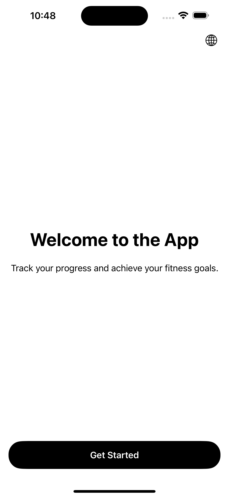
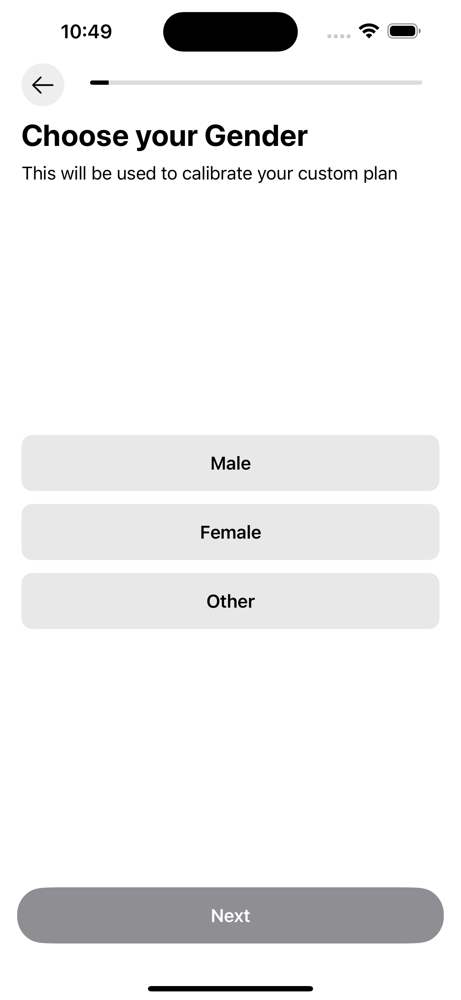
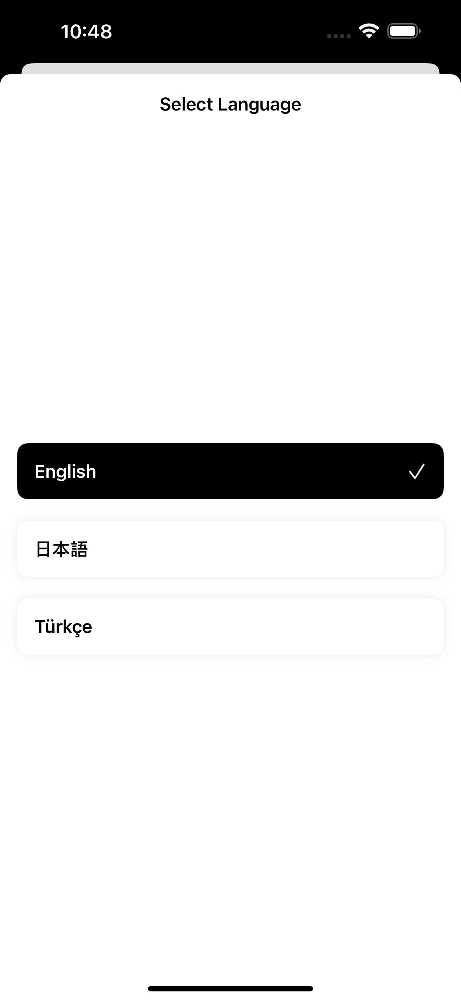
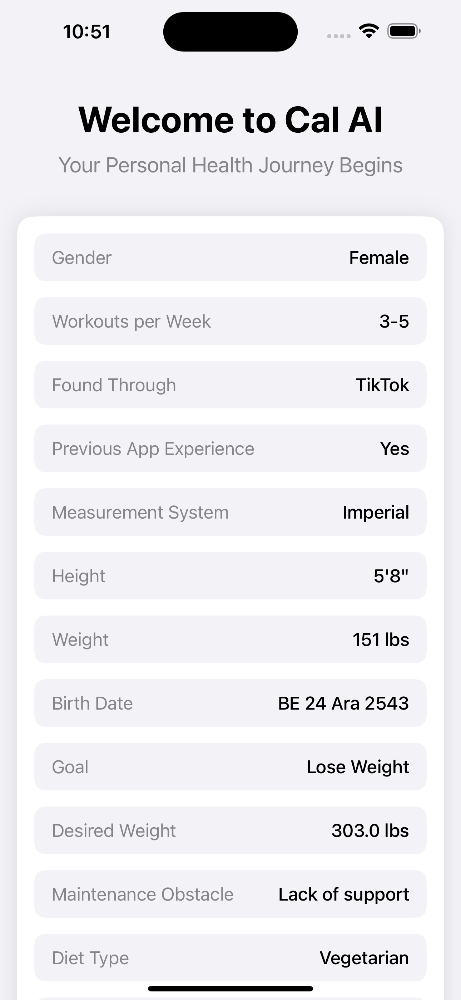

# Cal AI App Clone

A SwiftUI implementation of the Cal AI app's onboarding flow, demonstrating modern iOS UI development practices and user interaction patterns.

## 📱 Project Overview

This project recreates the onboarding experience of the Cal AI application using SwiftUI. The implementation focuses on creating a smooth, intuitive user interface while maintaining the original app's functionality and aesthetic appeal.

### Key Features

- **Four Main Pages**:
  - Intro Page
  - Onboarding Flow
  - Language Selection
  - Home Dashboard

- **Comprehensive Onboarding**:
  - 18 interactive form screens
  - Conditional navigation based on user goals
  - Dynamic form flow for weight management choices
  - Custom animations using Lottie

- **Smart Navigation Logic**:
  - Specialized paths for "lose weight" and "gain weight" goals
  - Direct routing to Maintenance Obstacles View for users selecting "maintain"
  - Seamless transition between forms

### Screenshots

### Intro Page

### Onboarding Page

### Language Selection

### Home Dashboard

### Demo Video

[Place your video demonstration here]

## 🛠 Technical Approach

### Development Strategy

Coming from a UIKit background, I approached this SwiftUI project with a unique perspective. The transition from UIKit to SwiftUI presented both challenges and opportunities to explore modern iOS development patterns.

### Learning Resources
- Stack Overflow
- Hacking with Swift (SwiftUI)
- ChatGPT for problem-solving
- Official Apple Documentation

### Challenges & Solutions

#### Custom UI Components
The main challenge was implementing custom UI components in SwiftUI, particularly:
- Creating responsive form elements
- Implementing custom animations
- Building the RulerView component (marked for future refinement)

#### Future Improvements
- Redesign and optimize RulerView implementation
- Enhanced animation transitions
- Additional customization options

## 🔧 Technical Details

### Dependencies
- Lottie for iOS animations
- SwiftUI framework
- [Add any other dependencies]

### Requirements
- iOS 14.0+
- Xcode 13.0+
- Swift 5.0+

## 📝 Notes

This project serves as a learning exercise in SwiftUI development and demonstrates the transition from UIKit to SwiftUI thinking. While most functionality has been successfully implemented, some components (like the RulerView) are marked for future optimization.

## 🤝 Contributing

Feel free to submit issues and enhancement requests.
